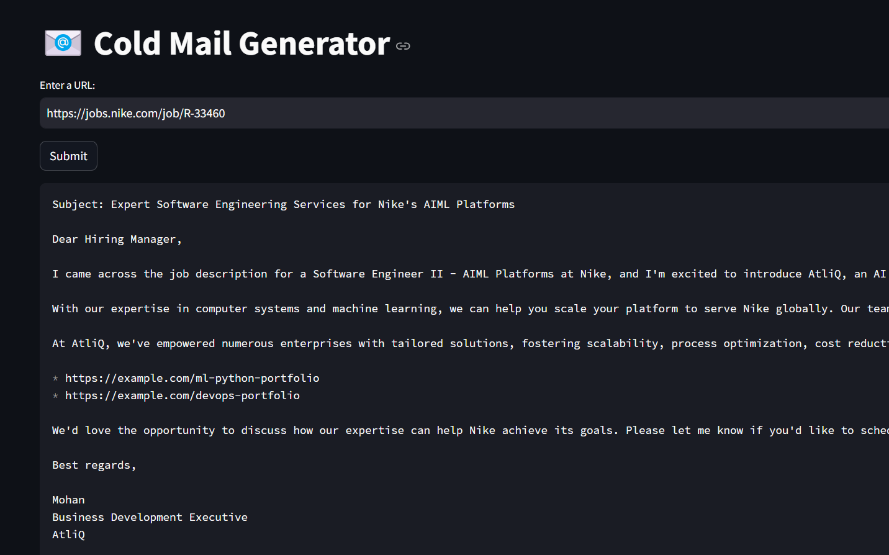

# 📧 Cold Mail Generator
Generic cold email generator for any company using groq, langchain and streamlit. It allows users to input the URL of a company's careers page. The tool then extracts job listings from that page and generates personalized cold emails. These emails include relevant portfolio links sourced from a vector database, based on the specific job descriptions.

**✨ Now Generic!** - No more hardcoded company names. Fully customizable for any business. 

**Imagine a scenario:**

- Nike needs a Principal Software Engineer and is spending time and resources in the hiring process, on boarding, training etc
- Your company is a Software Development company that can provide a dedicated software development engineer to Nike. So, your business development executive is going to reach out to Nike via a cold email.



## Architecture Diagram


## Set-up
1. **Configure your company** - Edit `config.py` with your company details (see `SETUP_GUIDE.md`)

2. **Get API Key** - Get a free API key from https://console.groq.com/keys and create `app/.env` with:
   ```
   GROQ_API_KEY=your_api_key_here
   ```

3. **Install dependencies**:
   ```commandline
   pip install -r requirements.txt
   ```
   
4. **Run the app**:
   ```commandline
   streamlit run app/main.py
   ```

## Customization
- **Company Settings Tab** - Configure company details via web interface
- **Config File** - Edit `config.py` for permanent changes
- **Portfolio** - Replace `my_portfolio.csv` with your projects
   

Copyright (C) Codebasics Inc. All rights reserved.

**Additional Terms:**
This software is licensed under the MIT License. However, commercial use of this software is strictly prohibited without prior written permission from the author. Attribution must be given in all copies or substantial portions of the software.
